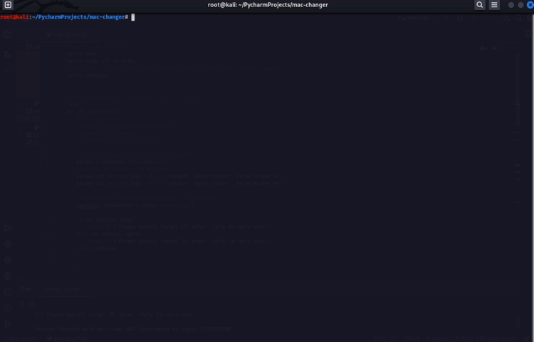
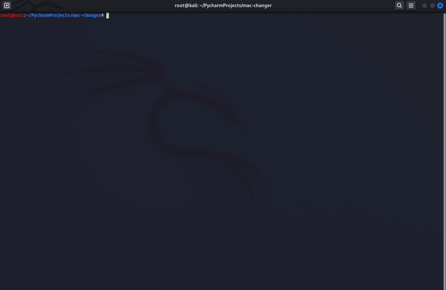

# MAC-changer


MAC-CHANGER script was developed using Python 3, Linux commands and can be launched in Linux command line. Script shows current MAC-address of device and changed address by user, using options and arguments of script.

---
##### MAC-CHANGER is a simple and powerful tool that allows you to change the MAC address of your network interface on Linux. This can be useful for a variety of purposes, such as:

* Protecting your privacy: MAC addresses are unique identifiers that can be used to track your network activity. By changing your MAC address, you can make it more difficult for people to track you online.
* Bypassing MAC filtering: Some networks restrict access to devices based on their MAC address. By changing your MAC address, you can gain access to these networks.
* Testing network security: You can use macchanger to test the security of your network by changing the MAC address of your device and seeing if you are still able to access the network.
---

### Running  

To run this project, install it locally cloning repo, than using next configurations in Linux CLI:
```
> cd ./mac_changer
> ./ mac_changer.py -i "specify an interface" -r "specify new MAC-address"
> ./ mac_changer.py -i eth0 -r 00:2w:33:4c:55:6d
```



---

### Help command

To get more information about script's argument, use next command:

```
> cd ./mac_changer
> ./ mac_changer.py --help
```



---

